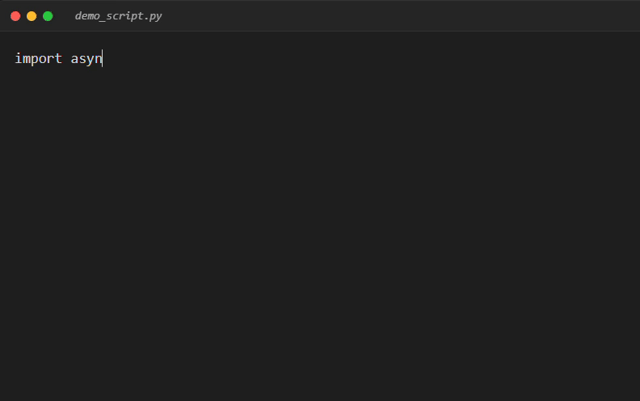

# HumanTypingTS 🤖⌨️

[](https://opensource.org/licenses/MIT)

> A TypeScript port of [HumanTyping](https://github.com/Lax3n/HumanTyping) by [@Lax3n](https://github.com/Lax3n).

**The most realistic keyboard typing simulator** based on Markov Chains and stochastic processes.

HumanTyping models authentic human typing behavior with unprecedented accuracy, making automated typing indistinguishable from real users.

## 🎬 See It In Action



_Watch HumanTyping simulate realistic typing with natural speed variations, errors, and corrections._

---

## ⚡ Quick Start (Playwright)

```bash
# With npm
npx jsr add @etareduction/humantypingts

# With Deno
deno add jsr:humantypingts
```

```typescript
import { HumanTyper } from "humantypingts";
import { chromium } from "playwright";

const browser = await chromium.launch({ headless: false });
const page = await browser.newPage();
await page.goto("https://google.com");

const typer = new HumanTyper(70);  // Create typer

const searchBox = page.locator("[name='q']");
await searchBox.click();
await typer.type(searchBox, "realistic typing!");  // Type like a human!

await browser.close();
```

---

## ✨ Features

### Advanced Typing Simulation

- **Variable Speed**: Common words typed 40% faster, complex words 30% slower
- **Bigram Acceleration**: Frequent letter pairs (th, er, in) typed in rapid bursts
- **Fatigue Modeling**: Typing speed gradually decreases over time (0.05% per character)
- **Natural Pauses**: Micro-pauses between words (250ms average)

### Realistic Error Patterns

- **Neighbor Errors**: Types adjacent keys based on keyboard layout (QWERTY/AZERTY)
- **Swap Errors**: Character inversions like "teh" → "the"
- **Delayed Detection**: Some errors go unnoticed until final proofreading
- **Correction Behavior**: Uses Backspace immediately or navigates with arrow keys later

### Customization

- Adjustable WPM (Words Per Minute) with natural variance
- Support for accents and special characters
- Uppercase detection (Shift key penalty)
- Configurable error rates and reaction times

---

## 🧠 How It Works

HumanTyping uses a **semi-Markov process** where:

- **States** represent typing progress (characters typed)
- **Transitions** model keystrokes with time and accuracy variations
- **Error probability** depends on:
  - Word difficulty (common vs. rare)
  - Key distance on the keyboard
  - Character complexity (accents, uppercase)

The system maintains both a **mental cursor** (where the user thinks they are) and a **physical cursor** (actual position), allowing realistic proofreading and corrections.

---

## 📦 Installation

### Option 1: Install from JSR (Recommended) 🌟

```bash
# With Deno
deno add jsr:humantypingts

# With npm
npx jsr add @etareduction/humantypingts
```

### Option 2: Install from GitHub

```bash
# Clone the repository
git clone https://github.com/Lax3n/HumanTypingTS.git
cd HumanTypingTS

# Install dependencies
deno install
```

### Verify Installation

```bash
deno eval "import { HumanTyper } from './mod.ts'; console.log('✓ Installation successful!')"
```

---

## 🚀 Usage

### Demo Mode (Visual Simulation)

Watch typing happen in real-time with errors and corrections:

```typescript
import { demo_single_run } from "humantypingts";

await demo_single_run("Hello world, this is a realistic typing test.", 60);
```

**Options:**

- `wpm`: Set target typing speed (default: 60)

### Monte Carlo Mode (Statistical Analysis)

Generate statistics over multiple simulations:

```typescript
import { run_monte_carlo } from "humantypingts";

run_monte_carlo("Performance test", 80, 1000);
```

**Output:**

```
Running 1000 simulations for text: 'Performance test' (Target WPM: 80)

--- Monte Carlo Results ---
Estimated Mean Time : 3.2145 s
Standard Deviation  : 0.4521 s
Min / Max           : 2.1034 s / 5.8912 s
Computation Time    : 2.1456 s
```

---

## 🤖 Integration with Automation Frameworks

### Playwright

**The easiest way to add realistic typing to your Playwright scripts:**

```typescript
import { chromium } from "playwright";
import { HumanTyper } from "humantypingts";

const browser = await chromium.launch({ headless: false });
const page = await browser.newPage();
await page.goto("https://example.com");

// Create typer with custom WPM
const typer = new HumanTyper(70);

// Type realistically into any input field
const searchBox = page.locator("input[name='search']");
await searchBox.click();
await typer.type(searchBox, "How to type like a human?");

await browser.close();
```

**That's it!** Just 3 lines of code:

1. Import `HumanTyper`
2. Create an instance: `const typer = new HumanTyper(70)`
3. Type: `await typer.type(element, "your text")`

**The integration module handles all typing events:**

- Correct keystrokes
- Error keystrokes (wrong neighbors)
- Swap errors (character inversions)
- Backspace corrections
- Arrow key navigation (for late corrections)

---

## 🔧 Customization

Edit `src/humantyping/config.ts` to fine-tune the simulation:

```typescript
// Typing speed
export const DEFAULT_WPM = 60;        // Base speed
export const WPM_STD = 10;            // Variance between sessions

// Error rates
export const PROB_ERROR = 0.04;       // 4% chance of typing wrong key
export const PROB_SWAP_ERROR = 0.015; // 1.5% chance of swapping two characters
export const PROB_NOTICE_ERROR = 0.85; // 85% chance to notice errors immediately

// Speed adjustments
export const SPEED_BOOST_COMMON_WORD = 0.6;  // Common words 40% faster
export const SPEED_BOOST_BIGRAM = 0.4;        // Frequent bigrams 60% faster
export const SPEED_PENALTY_COMPLEX_WORD = 1.3; // Complex words 30% slower

// Timing (seconds)
export const TIME_SPACE_PAUSE_MEAN = 0.25;   // Pause between words
export const TIME_BACKSPACE_MEAN = 0.12;     // Backspace press time
export const TIME_ARROW_MEAN = 0.15;         // Arrow key navigation time
export const TIME_REACTION_MEAN = 0.35;      // "Oops" delay after error

// Fatigue
export const FATIGUE_FACTOR = 1.0005;        // 0.05% slowdown per character
```

---

## 📂 Project Structure

```
HumanTypingTS/
├── src/
│   ├── humantyping/
│   │   ├── config.ts         // All simulation parameters
│   │   ├── typer.ts          // Core Markov model and state machine
│   │   ├── keyboard.ts       // QWERTY/AZERTY layouts, key distances
│   │   ├── language.ts       // Word difficulty, common bigrams
│   │   ├── simulation.ts     // Demo and Monte Carlo runners
│   │   └── integration.ts    // Playwright integration
│   └── numpy_compat/         // NumPy compatibility layer
├── mod.ts                    // Main module exports
├── deno.json                 // Deno configuration
└── README.md
```

---

## 🤝 Contributing

**Forks and contributions are very welcome!**

Ideas for enhancements:

- Additional keyboard layouts (Dvorak, Colemak)
- Language-specific models (French, Spanish, etc.)
- Time-of-day fatigue patterns
- Muscle memory for repeated phrases
- Copy-paste detection avoidance

Open an issue or submit a PR!

---

## 📊 Example Output

```typescript
import { demo_single_run } from "humantypingts";

await demo_single_run("The quick brown fox jumps.", 60);
```

```
--- Real-Time Simulation Demo: 'The quick brown fox jumps.' (Target WPM: 60.0) ---
Preparing simulation...

START TYPING:
----------------------------------------
The quick brown fox jumps.
----------------------------------------

Total Simulated Time: 6.2341s

Errors made and corrected: 1
```

---

## 🎯 Use Cases

- **Browser Automation**: Bypass typing detection systems
- **Testing**: Simulate realistic user input for QA
- **Research**: Study typing patterns and ergonomics
- **Education**: Demonstrate Markov processes and stochastic modeling

---

## 📜 License

MIT License - Feel free to use in your projects!

---

_Built with ❤️ and probabilities by the open-source community._
